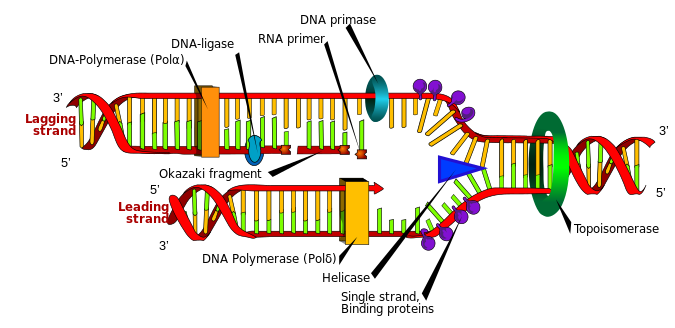

# dna-sequencer

Simlple dna sequence illustration tool with draggable neucleotides. 

Designed to introduce 10 yr olds to the building blocks of life.

Enter your dna sequence and click the button , then drag the neucleotides into the correct order.

The built in mp3 player contains an audio introduction written by 'Zendog' UI and converted from txt 2 mp3 by 'Eve' ,

(electronic voice emulator) @ https://eve-red.vercel.app/

Eve used the 'tts-1' , ' Whisper' voice known as 'Shimmer'. (openai api key required).

The cpmplete package can be found in the 'dna.zip' folder above , click the link then click the download icon top right to auto download

unzip the folder and off you go...ZERO (0) C0De required...just click 'dna.html' to open in your default browser.

Nucleotides, while essential components of DNA and RNA, are not inherently complex.

In the context of DNA sequences and genetics,

nucleotides are the building blocks that make up the genetic information in living organisms.

The four nucleotides present in DNA are adenine (A), cytosine (C), guanine (G), and thymine (T).

While the concept of nucleotides and their roles in genetics can be intricate when delving into topics like DNA replication,

gene expression, and genetic mutations, the basic understanding that A pairs with T and C pairs with G (complementary base pairing)

forms the foundation of DNA structure and function.

For the purpose of a simple illustration tool like the one provided , the complexity of nucleotides is abstracted into a basic

visual representation by associating colors with each nucleotide to help users visually distinguish them in the DNA sequence.

This abstraction simplifies the visualization process and allows users to interact with DNA sequences in a more accessible and engaging way.

# credits.

Mulciber , zendog , eve . (psico communications) . Distribute at will. (apache 2.0).
'WE come in peace 4 all mankind'....................................................Omnia connexia.
